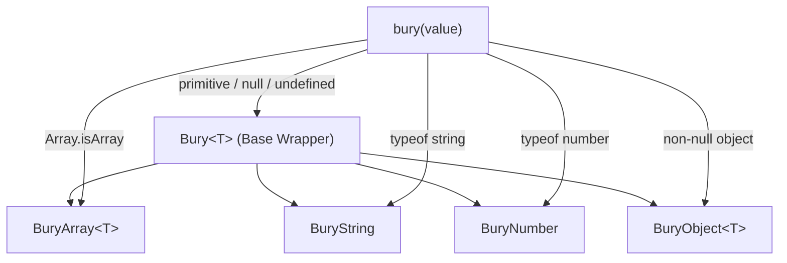

# Architecture & Philosophy

`bury2` is architected with modern TypeScript, high performance, and safe engineering principles at its core.

---

## Design Principles

### 1. Zero Prototype Pollution
Native prototypes (`Array.prototype`, `String.prototype`, `Number.prototype`, `Object.prototype`) are left 100% unaltered. This ensures `bury2` can be safely used in:
- Multi-team monorepos
- Third-party reusable npm packages
- Complex application architectures where prototype collisions cause severe bugs

### 2. Pure Immutability
All transformation methods produce and return a **new wrapper object** wrapping a **newly computed data structure**. The underlying input provided to `bury(...)` is never altered.

### 3. Progressive TypeScript Type Inference
The type system tracks transformations across method chains seamlessly:
- `.compact`: Narrow `(T | null | undefined)[]` $\to$ `NonNullable<T>[]`
- `.pluck('key')`: Narrow `T[]` $\to$ `T[key][]`
- `.keys`: Return `BuryArray<string>`
- `.values`: Return `BuryArray<T[keyof T]>`
- `.to_s`: Transition from `BuryNumber` $\to$ `BuryString`

---

## Class Hierarchy

---

## Packaging & Compatibility

- **ESM (`dist/index.js`)**: Modern ES modules for Vite, Webpack 5, Rollup, Node.js 18+.
- **CommonJS (`dist/index.cjs`)**: Full backward compatibility for older Node.js environments.
- **Type Definitions (`dist/index.d.ts`)**: Bundled TypeScript typings.
- **Zero Runtime Dependencies**: Zero `node_modules` overhead in production bundles.
