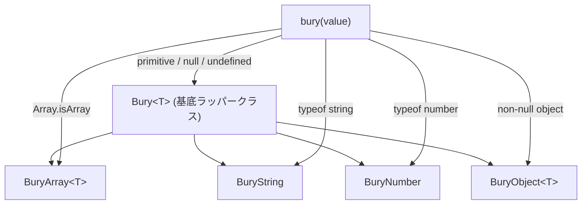

# アーキテクチャと設計思想

`bury2` は、モダンな TypeScript 開発体験、安全性、高パフォーマンスを中核に据えて設計されています。

---

## 主要な設計原則

### 1. プロトタイプ汚染ゼロ (Zero Prototype Pollution)
`Array.prototype`, `String.prototype`, `Number.prototype`, `Object.prototype` などのネイティブ組み込みオブジェクトを一切変更しません。これにより、以下の環境でも安心して導入できます:
- 複数チームが参加するモノレポ
- 他プロジェクトから参照される公開 npm パッケージ
- 厳格な安定性が要求されるプロダクション環境

### 2. 完全なイミュータビリティ (Pure Immutability)
すべての変換メソッドは、新しいラッパーインスタンスと新しいデータ構造を生成して返します。`bury(...)` に渡された元のデータが副作用で書き換わることはありません。

### 3. 正確な TypeScript 型推論
TypeScript の型システムがメソッドチェーン全体を通じてシームレスに型を追跡・絞り込みます:
- `.compact`: `(T | null | undefined)[]` $\to$ `NonNullable<T>[]` への自動絞り込み
- `.pluck('key')`: `T[]` $\to$ `T[key][]` へのプロパティ型抽出
- `.keys`: `BuryArray<string>` を返却
- `.values`: `BuryArray<T[keyof T]>` を返却
- `.to_s`: `BuryNumber` から `BuryString` への型変換

---

## クラス階層構造

---

## パッケージングと互換性

- **ESM (`dist/index.js`)**: Vite, Webpack 5, Rollup, Node.js 18+ 向けのモダン ES モジュール。
- **CommonJS (`dist/index.cjs`)**: 従来の Node.js 環境向けの後方互換モジュール。
- **型定義 (`dist/index.d.ts`)**: 完全な TypeScript 定義ファイル。
- **外部依存ゼロ**: プロダクションビルドに余計な `node_modules` は一切含まれません。
